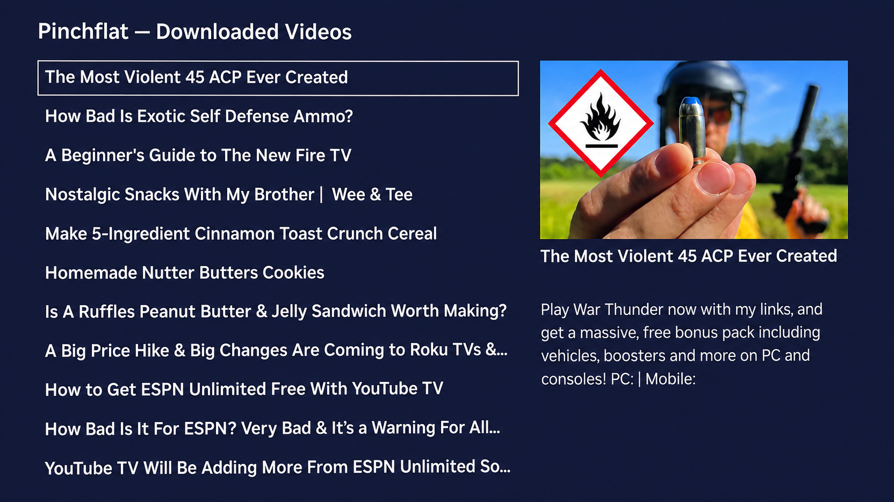
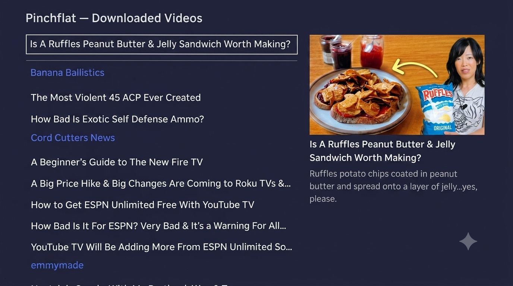
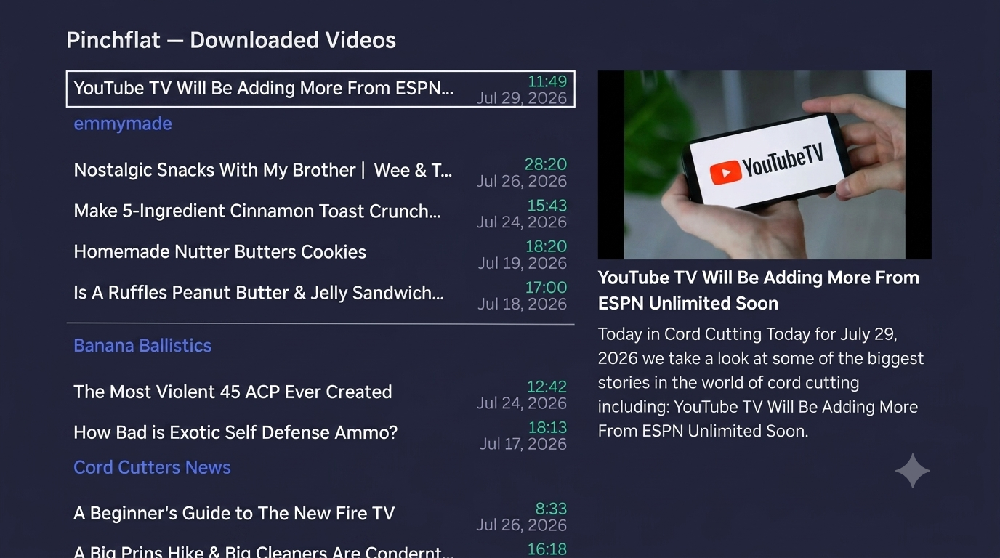
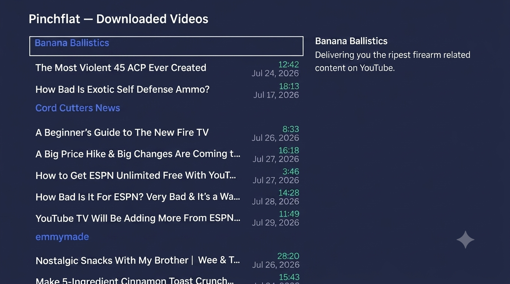

# Pinchflat Roku Client

A native Roku TV channel client written in BrightScript and Roku SceneGraph (RSG) to browse, stream, and manage video libraries downloaded and indexed by your self-hosted **khartupee/pinchflat-roku Pinchflat** server.

---

## 📺 Screens & Dialogue Navigation

### 1. Main Media Grid

Three layout modes selectable from **Settings → Change Layout**:

| Mode | Left Panel | Right Panel |
|---|---|---|
| **Standard** | Flat list, video title only, no headers | Poster, title, description |
| **Grouped** | Source headers (focusable) + video titles beneath | Poster, title, description |
| **Compact** | Source headers (focusable) + video titles, durations, and upload dates | Poster, title, duration, date |

|  |  |  |
|---|---|---|
| *Standard layout* | *Grouped layout* | *Compact layout* |

* **Left Panel:** Scrollable, vertical `MarkupList` with custom row component (`CompactRow`). Renders video titles, optional duration, and optional upload date depending on the active layout mode. Source headers mark the beginning of each source group.
* **Right Panel:** Visual details preview. When a video is focused, displays the title, high-resolution thumbnail artwork, and formatted description. When a source header is focused, displays the source name and description (shifted into the poster area since sources have no thumbnail).
* **Dynamic Poster Loading Debounce:** Incorporates a 150ms focus-change timer. When scrolling quickly through the list, image downloading is postponed until scrolling stops, delivering a fluid, lag-free UI experience.


*When a source header is focused, the source name and description appear in the right panel.*

### 2. Fullscreen Video Player
* Pressing **OK** (Select) on a list item automatically launches the full-screen native `Video` player node.
* Implements robust HTTP byte-range request streaming, allowing fluid fast-forwarding, rewinding, and stable pause/seeking of `.mp4` video files.
* Intercepts the remote **Back** button during playback to cleanly terminate the stream, hide the player, and restore navigation focus to your video list.

### 3. Server Input Prompt
* On initial launch (or if the database is reset/unreachable), the client displays a `StandardKeyboardDialog` asking the user to type in their Pinchflat Server IP address and port (e.g. `192.168.1.7:8945`).

### 4. Options Menu Dialog
* Pressing the **Options (`*`)** button on your Roku remote opens a modal dialog box for administrative actions, containing options for:
  * **Play:** Play the highlighted video.
  * **Delete File:** Requests the server to delete both the database entry and the physical files on disk, freeing up host storage.
  * **Delete & Ignore:** Deletes the video files and registers a filter ignore-rule on the server to prevent yt-dlp from re-downloading it in future feed sweeps.
  * **Refresh Feed:** Fetches the latest video list from the server without requiring an app restart. Useful when new content has been downloaded while you're browsing, or after deleting videos and wanting to check for new arrivals.
  * **Settings:** Opens the Settings dialog.
  * **Cancel:** Close the menu.

### 5. Video Finished Dialog
* When a video finishes playing, if the setting is toggled **ON**, the channel prompts you with a finished dialog showing a quick-delete action:
  * **Delete & Ignore:** Instantly delete the file and ignore the video.
  * **Keep Video:** Close the dialog and keep the video files.

### 6. Settings Dialog
* Opens a modal dialog with configurable options (layout mode toggle, post-play dialog toggle, etc.).
* Includes **Change Auth** to update or remove Basic Auth credentials.
* Shows **Auth: Configured** or **Auth: Not Set** so you know the current state (the username is never displayed).

### 7. Basic Authentication
* If your Pinchflat server requires Basic Auth (configured via `BASIC_AUTH_USERNAME` and `BASIC_AUTH_PASSWORD` in `compose.yaml`), the client handles it automatically:
  * **Auto-detection:** On launch, the client always tries loading the feed first. If the server doesn't require auth, the feed loads immediately with no prompt. If the feed fails but the server is reachable, the client prompts for credentials.
  * **Two-step credential dialog:** The username and password are collected in separate dialogs to avoid exposing typed characters on screen.
  * **Persistent storage:** Credentials are saved in the Roku's local registry and reused on subsequent launches.
  * **Settings → Change Auth:** Update or clear credentials at any time from the Settings dialog.
* **Server-side configuration:** Set these environment variables in your `compose.yaml`:
  ```yaml
  environment:
    - BASIC_AUTH_USERNAME=your_username
    - BASIC_AUTH_PASSWORD=your_password
  ```
  When these variables are **not** set, the API works without authentication and the client will never prompt for credentials.

---

## ⚙️ Persistent Settings & Registry

The client persistent data is managed on your TV's flash storage using Roku's native `roRegistrySection` under the section name **`AppSettings`**:

* **`serverURL`**: Stores your self-hosted Pinchflat server's IP address or hostname (e.g., `192.168.1.7:8945`). The client normalizes all URLs to HTTPS via `rewriteURL()` to prevent NGINX redirect issues.
* **`showPostPlayDialog`**: Boolean string ("true"/"false") indicating whether the "Video Finished" auto-delete dialog should prompt after a video reaches its end.
* **`layoutMode`**: String — one of `"standard"`, `"grouped"`, or `"compact"`. Controls the MarkupList rendering mode.
* **`basicAuthUsername`**: String — Basic Auth username for the Pinchflat server. Empty string if the server doesn't require authentication.
* **`basicAuthPassword`**: String — Basic Auth password for the Pinchflat server. Empty string if the server doesn't require authentication.

---

## ⚡ Caching & Lazy-Loading Architecture

To maintain high responsiveness, the client implements a **lazy-loading thumbnail cache** inside `APITask.brs`:
1. When scrolling, if a video's thumbnail is not in `m.thumbnailCache`, the client requests `APITask` to download it.
2. `APITask` fetches the image asynchronously from the Pinchflat server on a separate thread, saving it as a local temporary asset at `tmp:/thumb_<videoId>.jpg`.
3. Once downloaded, `thumbnailResult` is fired, storing the local file path in `m.thumbnailCache` so subsequent list focus events load the poster instantly without requiring network roundtrips.

---

## 🧪 Testing

The project includes a **Rooibos on-device test suite** with 35 tests covering all utility functions. The same source code is used for both testing and production deployment — no duplicate utility files are needed. BrighterScript (`.bs`) handles imports correctly in both modes.

### Quick start

```bash
npm install          # Install test dependencies (BrighterScript, Rooibos)
npm run check        # Verify setup (Node.js, .env, dependencies)
npm test             # Compile + deploy + run tests on your Roku
```

Tests read Roku credentials from `.env` (copy `.env.example` → `.env` and fill in your values).

See [TEST_PLAN_BRIGHTSCRIPT.md](TEST_PLAN_BRIGHTSCRIPT.md) for full details.

---

## 🚀 Build & Deployment

Deployment scripts dynamically resolve their directories relative to their execution paths, making development painless.

### First-time setup

1. Create a `.env` file with your Roku credentials:
    ```bash
    cp .env.example .env
    ```
2. Edit `.env` and fill in your Roku's IP address and Developer Mode password.
   The `.env` file is git-ignored, so your credentials are never committed to the repository.

### Deploy

Compile and push the package directly to your developer-enabled Roku:
    ```bash
    bash deploy.sh
    ```